**MRT批量处理hdf数据文件**

1、安装jdk以及MRT

2、进入MRT安装目录，在bin文件夹下双击“ModisTool.jar"

打开界面如下：
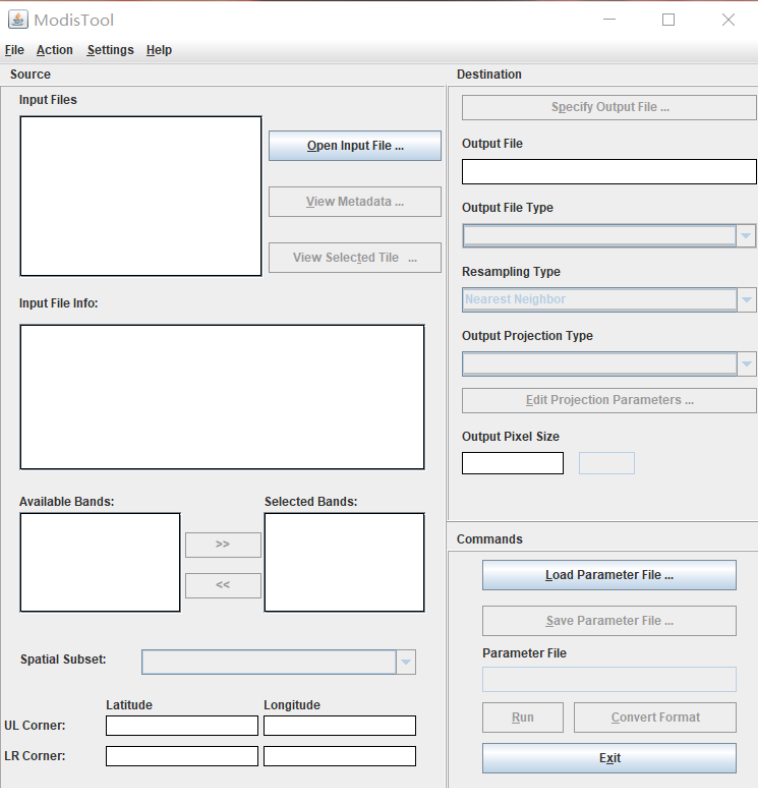

3、点击"Open lnput File..."按键按钮导入待处理的.hdf文件
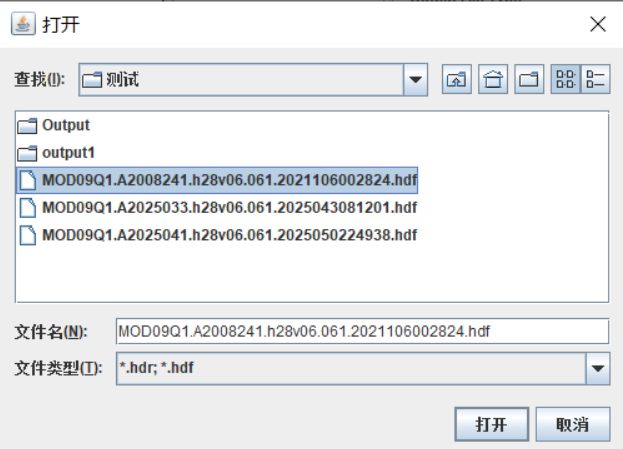

4、将不想要输出的波段选择并点击"<<"按钮移动至左边
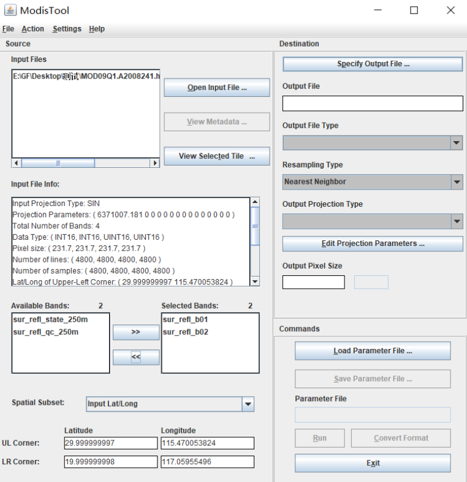

5、点击'Specify Output File...'按钮选择输出的文件类型与路径，在'Resampling Type'中选择重采样类型
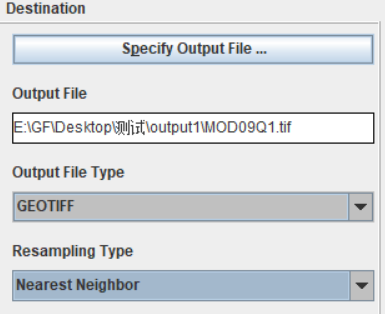

6、点击'Out普通 Projection Type'选择输出图像的投影类型
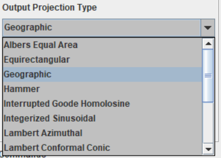

7、点击'Edit Projection ParaMeters...'按钮修改投影参数
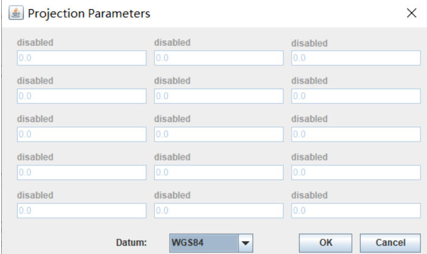

8、在左下角输入裁剪的范围
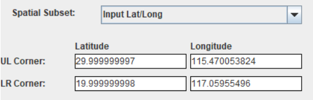
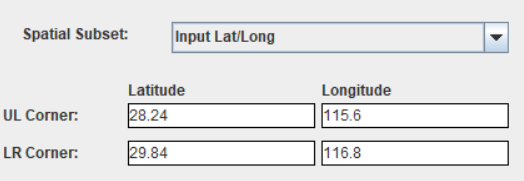

9、点击'Save Parameter File'按钮将prm文件进行保存
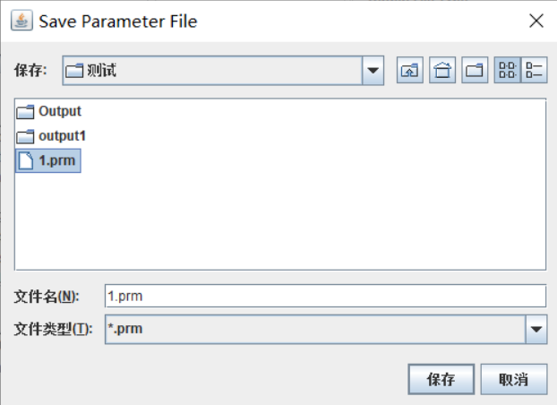

10、点击"Run"按钮既可以对单张进行波段提取 

11、在MRT目录下bin文件夹中唤出cmd命令行窗口
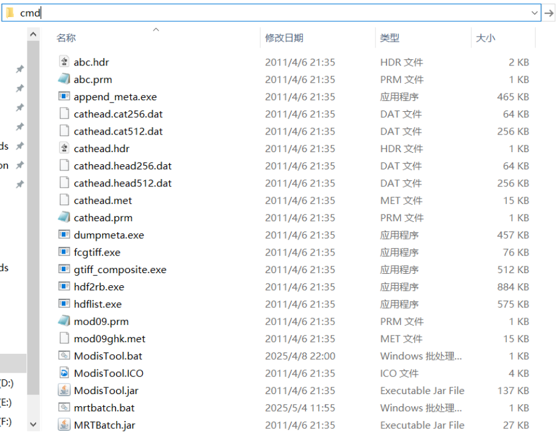
12、输入"java -jar MRTBatch.jar -d E:\GF\Desktop\测试 -p E:\GF\Desktop\测试\1.prm -o E:\GF\Desktop\测试\output1"命令
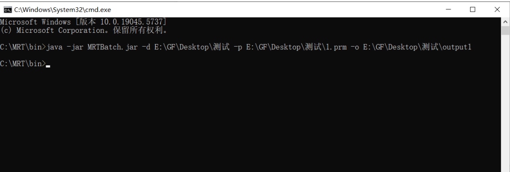
    其中：

        -d后面是待批处理数据所在文件夹

        -p后面是先前生成的.prm文件所的位置

        -o后面是待批量输出数据所在文件夹

    点击回车运行再输入：MRTBatch.bat 即可开始批处理
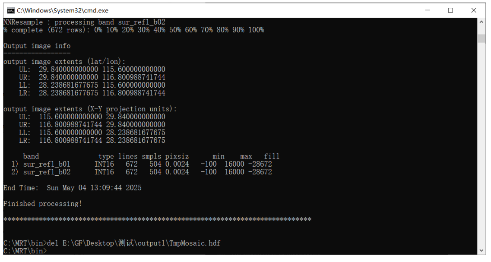

13、在输出文件夹即可找到批量提取并裁剪后的波段图像
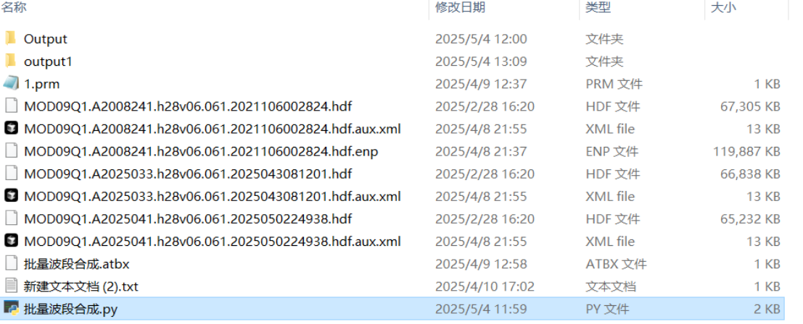

14、利用python代码进行批量波段合成并输出
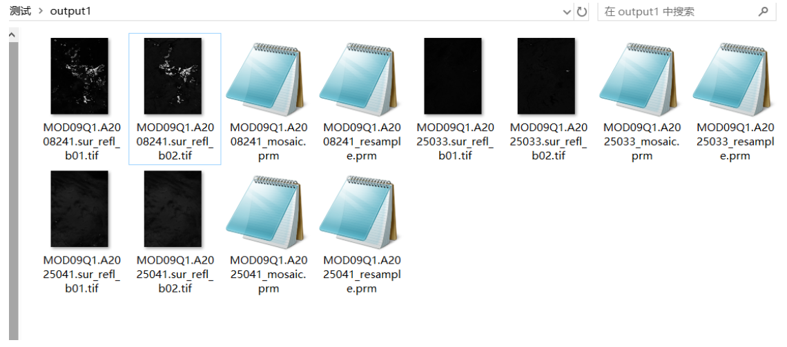

